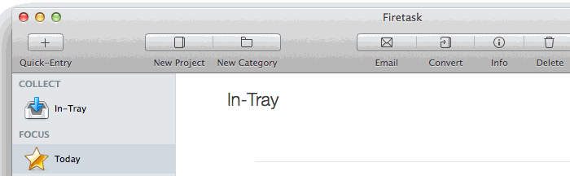

Firetask for Alfred 2
==============

 

This workflow lets you add new tasks to the "In-Tray" of Firetask using Alfred.

### Demo:

### Requirements:

In order to use this workflow you need:

- [Alfred 2](http://www.alfredapp.com "Alfred - Productivity App for Mac OS X") App.
- [Powerpack](http://www.alfredapp.com/powerpack/ "Boost your productivity even further with the Powerpack") addon for Alfred 2.

- [Firetask](http://www.firetask.com "Firetask: Project-oriented GTD Task Management for Mac OS X") App.

### Download:

Click [here](https://github.com/fbcom/alfred2firetask/archive/master.zip) to dowload a zip file.

### Installation:

1. Unzip the downloaded file.
2. Double click on the workflow file to install it in Alfred or drag it onto the Alfred workflow screen.

### Usage

Use the "ft" trigger to show the dialog to add tasks (see demo above):

1. Type "ft " followed by a description of what your new task is.
2. Hit [Enter] to add the task to Firetask.
3. \o/

### Features:

- Ability to add a new Task to the "In-Tray" of Firetask.

## Contributing

1. Fork this!
2. Create your awesome feature branch: `git checkout -b my-new-awesome-feature`
3. Commit your changes: `git commit -m 'Add some awesome feature'`
4. Push to the branch: `git push origin my-new-awesome-feature`
5. Submit a pull request :-)

## License

Logos are protected by copyright by their respective owners. 

__Alfred__ &reg; is a registered trademark of Running with Crayons Ltd. 
__Firetask__ &reg; is a registered trademark of Gerald Aquila. 

This workflow is not affiliated with or endorsed by Gerald Aquila or Crayons Ltd.

[GNU General Public License Version 3, 29 June 2007 (GLP-3.0)](https://github.com/fbcom/alfred2firetask/blob/master/LICENSE) © Florian Buetow
